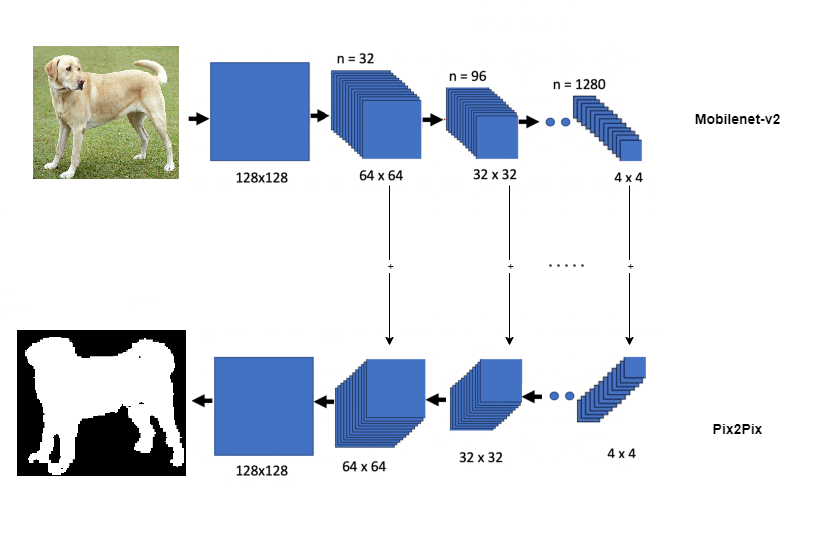
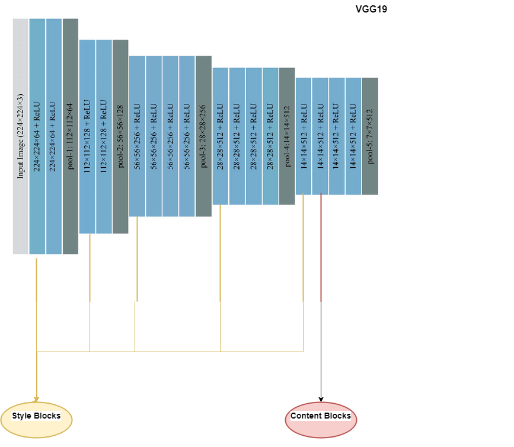
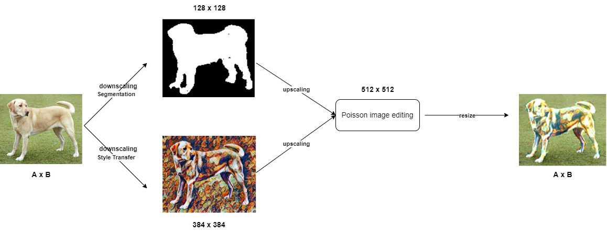

# Magic Portrait

## Table of Content
* [Demo](#demo-and-installation)
* [Overview](#overview)
* [Technical Aspect](#technical-aspect)
* [Directory Tree](#directory-tree)
* [Screenshots from the application environment](#screenshots-from-the-application-environment)
* [To Do](#to-do)
* [Bug / Feature Request](#bug--feature-request)
* [Technologies Used](#technologies-used)
* [Credits](#credits)


## Demo and Installation
Download the app from [here](https://github.com/Abtinmy/magic-portrait/releases/tag/v1.0.0). 


## Overview
In this application with the help of artificial intelligence and deep learning, two deep models have been created. The first one is a segmentation model which can mask out every pet that has appeared in the original image. The second one is a style transfer model which can change the style of the original image to the desired style which can be a painting from a famous artist or a natural texture (like wood).

Then, the obtained images from these models are combined into a single image using Poisson image editing, in a way that, the background of the original image stays unchanged, and pets recognized from the segmentation model change to style transformed image.

## Technical Aspect
This project is divided into four parts:
1. Training a deep segmentation model.
2. Training a deep style transfer model.
3. Saved the trained models in TFLite format.
4. Building an Android app.
    - The user can choose an image from the device's gallery, capture it using the device's camera, or use the sample pre-defined image.
    - Use the saved TFLite segmentation model to mask out every pet that appears in the image.
    - Use the saved TFLite style transfer model to transform the style of the content image to the desired style. (user can choose one of the 10 pre-defined styles or import a new style from the device's gallery.)
    - Combine the obtained images from these models using Poisson image editing.
    - Save the resulting image in the devices' storage.

### Segmentation
I used a modified [U-net](https://en.wikipedia.org/wiki/U-Net) model for the segmentation task. U-net is an auto-encoder in which in its' first half there is an encoder that transforms the original image into a different symbolic space, and in the second half, there is a decoder that transforms the results from the encoder to the target data. For training, I used [The Oxford-IIIT Pet Dataset](https://www.robots.ox.ac.uk/~vgg/data/pets/).

For the encoder, I used [mobilenet-v2](https://arxiv.org/abs/1801.04381) architecture, and for the decoder, upsamples block from [pix2pix](https://arxiv.org/abs/1611.07004) model. In the training phase, the encoder froze and only the weights of the decoder were updated. The resulting model can be seen in the following image.



### Style Transfer
For the style transfer model, I used pre-trained [VGG-19](https://arxiv.org/abs/1409.1556) as the base on which content and style images are fitted into. Some blocks in this model are dedicated to style images and some are for content images. these blocks' representation is gathered into one single representation for both style and content images. Then by calculating the mean square error for the models' output relative to each target, then take the weighted sum of these losses. finally, using gradient descent, we apply the gradients to the image. The resulting model can be seen in the following image.



### Image Blending
For blending the obtained images from these models, I used [Poisson image editing](https://en.wikipedia.org/wiki/Gradient-domain_image_processing#:~:text=Gradient%20domain%20image%20processing%2C%20also,on%20the%20pixel%20values%20directly.) technique which is a type of digital image processing that operates on the differences between neighboring pixels, rather than on the pixel values directly.  In gradient-domain methods, one fixes the colors of the boundary (taken from the background image) and provides a vector field that defines the structure of the image to be copied (taken from the foreground and/or a mixture of foreground and background). The resulting image is generated by minimizing the squared error terms between the gradient of the resulting image and the guidance vector field.

The complete workflow is demonstrated in the following diagram.


## Directory Tree
```
├── app 
│     ├── src
│     │      ├── main
│     │      │      ├── cpp
│     │      │      │     ├── SeamlessBlending
│     │      │      │     ├── CMakeLists.txt
│     │      │      │     └── native-lib.cpp
│     │      │      ├── ml
│     │      │      │     ├── segmentor.tflite
│     │      │      │     ├── stylemodel.tflite
│     │      │      │     └── transformer.tflite
│     │      │      ├── res
│     │      │      │     └── drawables
│     │      │      ├── java
│     │      │      │     ├── LoadingDialog.java
│     │      │      │     ├── MainActivity.java
│     └──    └──    └──   └── TransformerActivity.java
├── LICENSE
├── build.gradle
├── settings.gradle
├── .gitignore
└── README.md
```

## Screenshots from the application environment


## To Do
1. Parallelize the Poisson image editing process in order to speed up the application.
2. Extend the segmentation model to mask out various types of objects.
3. Build and train a deep neural network to blend the resulting images more accurately, for speed up and better performance.

## Bug / Feature Request
If you find a bug, kindly open an issue [here](https://github.com/Abtinmy/magic-portrait/issues/new) by including your inputs and the expected result.

If you'd like to request a new function, feel free to do so by opening an issue [here](https://github.com/Abtinmy/magic-portrait/issues/new). Please include sample inputs and their corresponding results.

## Technologies Used


## Credits
- [Segmentation tutorial from Tensorflow](https://www.tensorflow.org/tutorials/images/segmentation)
- [Style Transfer tutorial from Tensorflow](https://www.tensorflow.org/tutorials/generative/style_transfer)
- [The Oxford-IIIT Pet Dataset for segmentation task](https://www.robots.ox.ac.uk/~vgg/data/pets/)
- [Poisson image editing](https://github.com/cheind/poisson-image-editing)
- [TFLite tutorials from Tensorflow](https://www.tensorflow.org/lite/models)
- [Android guidlines and Tutorials](https://developer.android.com/docs)
